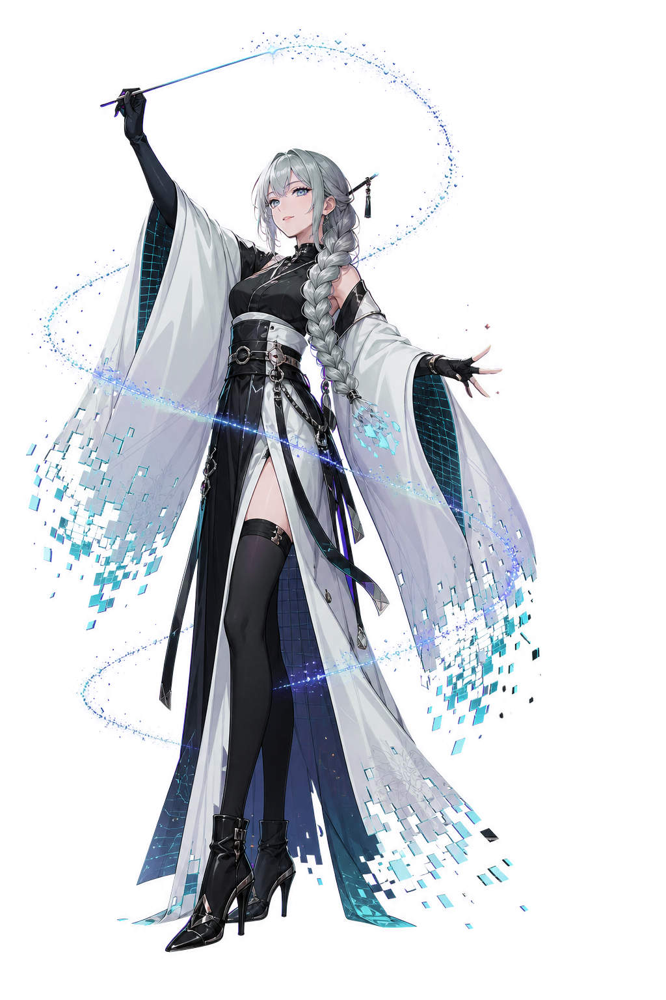

<p align="center">
  
</p>

<table>
  <tr>
    <td width="64%" valign="top">
      <h1>DreamFX</h1>
      <p><strong>Text-first Unreal Engine Niagara authoring with DreamFXLang.</strong></p>
      <p>
        DreamFX compiles <code>.dfs</code>, <code>.dfe</code> and <code>.dfm</code> source files into standard
        <code>UNiagaraSystem</code>, <code>UNiagaraEmitter</code> and <code>UNiagaraScript</code> assets — and
        decompiles any existing Niagara system back into source. The text is the authoring surface; the asset
        is build output, and can always be thrown away and regenerated.
      </p>
      <p>
        
        
        
      </p>
      <p>
        <a href="README.zh-CN.md">中文文档</a> &nbsp;·&nbsp;
        <a href="Docs/getting-started.md">Getting started</a> &nbsp;·&nbsp;
        <a href="Docs/language/README.md">Language reference</a> &nbsp;·&nbsp;
        <a href="Docs/diagnostics/README.md">Diagnostics</a> &nbsp;·&nbsp;
        <a href="Docs/tools/editor-integration.md">Editor tools</a> &nbsp;·&nbsp;
        <a href=".skill/">AI skills</a> &nbsp;·&nbsp;
        <a href="CHANGELOG.md">Changelog</a>
      </p>
      <p>
        <a href="https://github.com/TypeDreamMoon/DreamFX/issues">
          
        </a>
        <a href=".skill/">
          
        </a>
        <a href="https://github.com/TypeDreamMoon/DreamShader">
          
        </a>
      </p>
    </td>
    <td width="36%" align="center" valign="middle">
      
    </td>
  </tr>
</table>

> [!TIP]
> Keep every `.dfs`, `.dfe` and `.dfm` file in version control. The generated Niagara assets can
> always be rebuilt from source, so they do not need to be.

---

## What it looks like

```cpp
System(Name="Effects/NS_Hello", Root="Game")
{
    Properties = {
        float Speed = 150.0 [ Group="Motion" ];   // exposed as User.Speed
    }

    Emitter Motes
    {
        Settings = {
            SimTarget = CPU;  Determinism = true;  RandomSeed = 1;
            AllocationMode = Fixed;  PreAllocationCount = 64;
        }

        EmitterUpdate = {
            EmitterState(LifeCycleMode = Self, LoopBehavior = Infinite);
            SpawnRate(SpawnRate = 20.0);
        }

        ParticleSpawn = {
            Spawn/Initialization/V2/InitializeParticle(
                LifetimeMode = DirectSet, Lifetime = 2.0,
                SpriteSizeMode = Uniform, UniformSpriteSize = 8.0
            );
            SystemLocation();
            AddVelocityInCone(ConeAngle = 30.0, VelocityStrength = User.Speed);
        }

        ParticleUpdate = {
            ParticleState();
            GravityForce(Gravity = (0, 0, -400));
            SolveForcesAndVelocity();
        }

        SpriteRenderer Core
        {
            Alignment = Unaligned;  FacingMode = FaceCamera;  SortMode = ViewDepth;
        }
    }
}
```

```bash
pwsh -File Plugins/DreamFX/.skill/dfx.ps1 build DFX/Effects/NS_Hello.dfs
```

No editor required — generation runs headless. With the editor open, saving the file rebuilds the
asset live (file watcher), so a Niagara preview window doubles as a hot-reloading text workflow.

The language covers the full authoring surface: user parameters (including **data-interface
parameters with their configuration**), all six system/emitter stacks, **event handlers**
(`OnEvent(...)`), **named simulation stages** (iteration source, bindings, `ExecuteBehavior`,
`NumIterations`/`Enabled` as value *or* driving parameter), renderers with schema-driven properties
and `Bind`, static switches in every value form, nested dynamic inputs, `hlsl { }` blocks and
`curve { }` literals with tangent modes.

## Quick start

```bash
# 1. sanity check: can the driver reach the engine?
pwsh -File Plugins/DreamFX/.skill/dfx.ps1 list

# 2. build one file / verify without writing / lint only
pwsh -File Plugins/DreamFX/.skill/dfx.ps1 build  DFX/Effects/NS_Hello.dfs
pwsh -File Plugins/DreamFX/.skill/dfx.ps1 verify DFX/Effects/NS_Hello.dfs
pwsh -File Plugins/DreamFX/.skill/dfx.ps1 lint   DFX/Effects/NS_Hello.dfs

# 3. bring an existing Niagara system into text
pwsh -File Plugins/DreamFX/.skill/dfx.ps1 decompile /Game/VFX/NS_Explosion

# 4. the whole tree, CI-style
pwsh -File Plugins/DreamFX/.skill/ci.ps1
```

Fifteen-minute walkthrough: [Docs/getting-started.md](Docs/getting-started.md).

## What it generates

| File | Declares | Produces |
| :-- | :-- | :-- |
| `.dfs` | `System` | a `UNiagaraSystem` |
| `.dfe` | `Emitter` | nothing on its own — merged into a `.dfs` by `from` |
| `.dfm` | `Module` / `DynamicInput` | a `UNiagaraScript` (works on the installed engine through a reflection backend) |

## Round-trip, verified four ways

Decompilation is not a convenience export — it is a contract. Anything the language cannot express
is written into the file header as an explicit gap, never dropped silently, and `Adopt` refuses to
take over an asset unless the re-export matches byte for byte.

| Layer | Question it answers |
| :-- | :-- |
| **L1** `mirror-diff` | does the mirror's export match the original's, line by line? |
| **L2** | does the mirror compile clean? |
| **L3** | does the rebuilt system *simulate* like the original? (fixed-step SimCache, per-frame particle counts, self-control for nondeterministic content) |
| **asset-diff** | do the two assets agree *as assets* — reflection-walked facts including the compiler's own view, independent of the exporter? |

The 55-case corpus additionally compares "the asset built from a fixture" against "the asset rebuilt
from its export", so a loss that is symmetric on both sides of the text comparison still shows.
Exports land in a `Decompiled/<original path>` namespace: the whole tree is first-class source that
rebuilds into mirrors and structurally cannot touch the originals.

One more thing: the same source tree builds with **zero `#if` engine forks** on a customized source
build and on the stock installed engine.

## Documentation

| | |
| :-- | :-- |
| **[Getting started](Docs/getting-started.md)** | nothing → running effect, no editor required |
| **[Language reference](Docs/language/README.md)** | `.dfs` / `.dfe` / `.dfm`, values, curves, events, stages |
| **[Diagnostics](Docs/diagnostics/README.md)** | all 143 `DFXnnnn` codes with file/line/column, generated from source and drift-checked |
| **[Editor tools](Docs/tools/editor-integration.md)** | menus, right-click actions, toolbar, VSCode workspace |
| **[Changelog](CHANGELOG.md)** | what each release covers, and the known-issue list |

## Editor and tooling

| | |
| :-- | :-- |
| **Editor integration** | *Tools* menu, Content Browser right-click (build / decompile / Adopt / export `.dfe`), Niagara editor toolbar, level toolbar — all on the same pipeline, `-NoDreamFXEditor` turns it off |
| **File watcher** | save the source, the asset rebuilds; open the generated asset for a live preview |
| **`dfx.ps1`** | `build · verify · lint · decompile · decompile-all · mirror-diff · asset-diff · coverage · rename · schema · list · corpus` |
| **`ci.ps1`** | lint → build → verify → corpus, one command, editor closed |
| **Provenance stamps** | source hash + generator version + module version GUIDs on every generated asset; `verify` reports edited-by-hand, stale, and version-drifted assets |

## AI support

Four agent skills ship with the plugin under [`.skill/`](.skill/): `dream-fx-create`,
`dream-fx-verify`, `dream-fx-diagnose`, `dream-fx-decompile` — a coding agent can author, build,
debug and migrate effects headlessly.

## Requirements and boundaries

- **Engine**: Unreal Engine 5.8 (source builds and the installed/stock engine are both supported and
  release-verified). Depends on the engine's Niagara external-edit API (`UNiagaraExternalEditUtilities`,
  marked EXPERIMENTAL engine-side); drift is surfaced by startup self-checks, never absorbed silently.
- **Host projects must enable the same content plugins as the authoring project** (e.g.
  `NiagaraFluids`): an unmounted plugin blinds the module probe, and sources referencing its modules
  surface as explicit gaps or compile errors.
- **Close the editor for package-writing commands** (`build`, `corpus`, `mirror-diff`,
  `decompile-all`) — two processes saving the same packages race silently.
- Not covered (by design or not yet): Scratch Pad, module-internal graph lowering, GPU/CPU branch
  conditions, Scalability conditions, true emitter inheritance (`from` is a copy). Degradations are
  diagnosed, not silent — see [CHANGELOG](CHANGELOG.md) for the 1.0.0 known-issues list.
